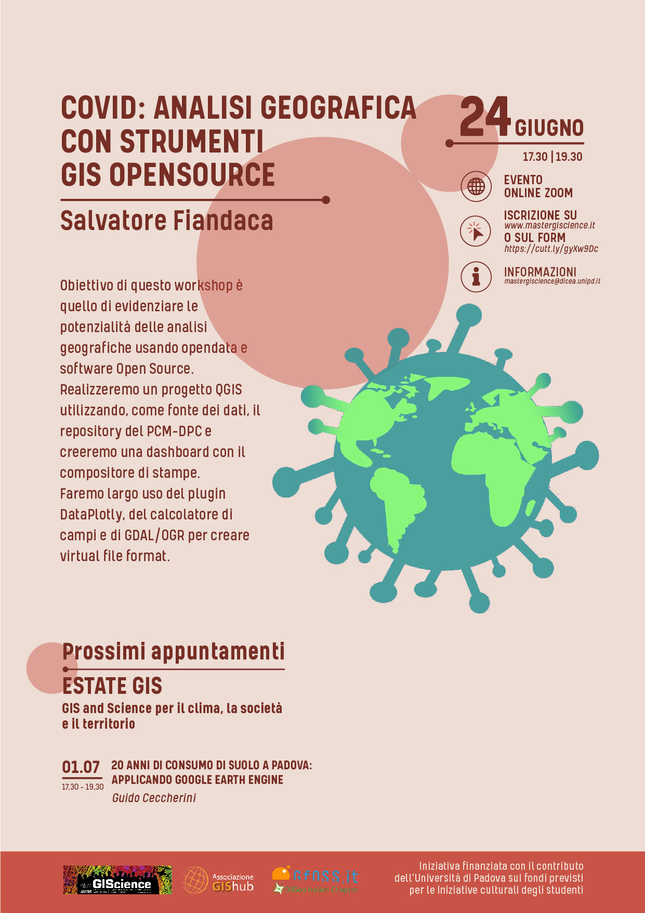
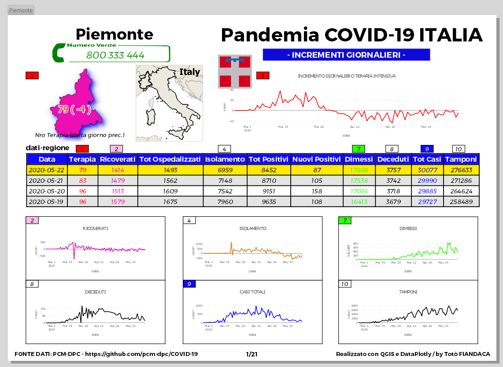
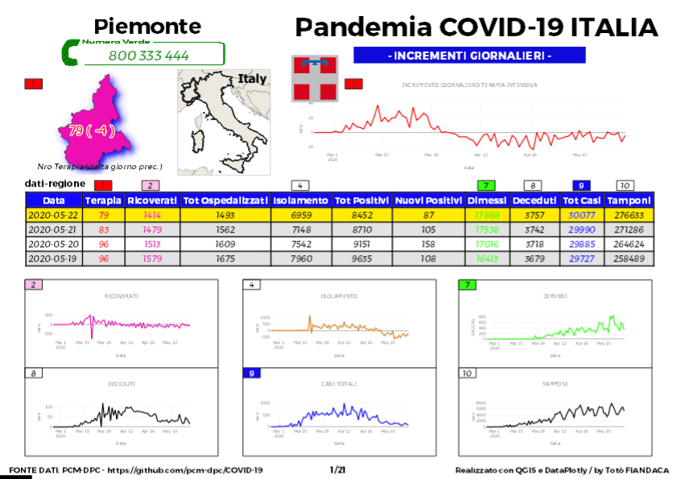
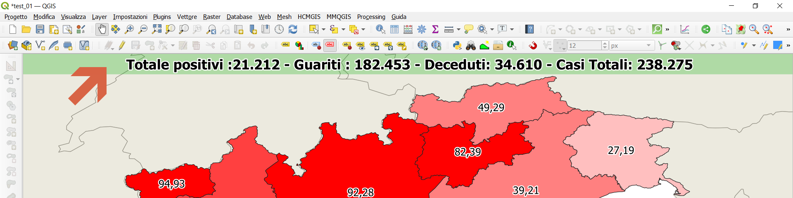
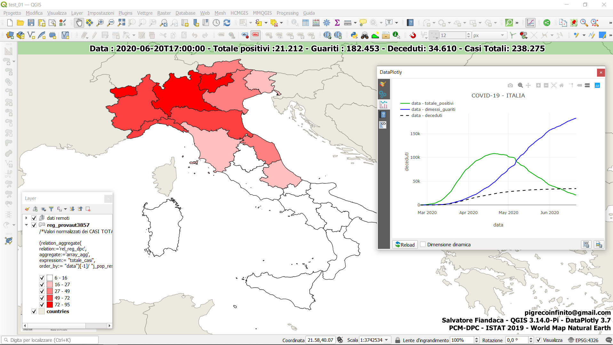

# Workshop estate GIS 2020 UNIPD

**INDICE**

<!-- TOC -->

- [Workshop estate GIS 2020 UNIPD](#workshop-estate-gis-2020-unipd)
  - [Relatore](#relatore)
  - [Data, luogo e durata](#data-luogo-e-durata)
  - [Piattaforme e Software](#piattaforme-e-software)
  - [Programma](#programma)
  - [Stampe PDF](#stampe-pdf)
  - [Dati](#dati)
  - [Contatti](#contatti)
  - [Sitografia](#sitografia)
- [Workshop](#workshop)
  - [Decorazione Etichetta Titolo](#decorazione-etichetta-titolo)
  - [Calcolo incrementi giornalieri](#calcolo-incrementi-giornalieri)
  - [Mappa coropletica normalizzata e grafici](#mappa-coropletica-normalizzata-e-grafici)
  - [Virtual File Format di GDAL/OGR](#virtual-file-format-di-gdalogr)
  - [Caratteristiche utilizzate nel progetto](#caratteristiche-utilizzate-nel-progetto)
  - [Riferimenti utili](#riferimenti-utili)
  - [Cosa c'è in questo repo](#cosa-cè-in-questo-repo)

<!-- /TOC -->

---

**TITOLO**: <br> Analisi geografica di dati sul [**COVID-19**](https://github.com/pcm-dpc/COVID-19) 🦠 sfruttando le potenzialità del _calcolatore dei campi_  di [**QGIS**](https://qgis.org/it/site/)  e i grafici del Plugin [**DataPlotly**](https://www.faunalia.eu/it/dev/dataplotly) , realizzazione di una dashboard.

**DESCRIZIONE**: <br> Obiettivo di questo workshop è quello di evidenziare le potenzialità delle analisi geografiche usando **opendata** e software **Open Source**. Realizzeremo un progetto **QGIS** utilizzando, come fonte dei dati, il repository del [**PCM-DPC**](https://github.com/pcm-dpc/COVID-19) e creeremo una **dashboard** con il compositore di stampe. Faremo largo uso del plugin **DataPlotly**, del calcolatore di campi e di **GDAL/OGR** per creare virtual file format.

<p align="center"><a href="https://www.mastergiscience.it/it_IT/2020/06/01/estate-gis-2020/" target="_blank"></a></p>

---


[](https://github.com/pigreco/seminario-estate-gis-2020/blob/master/license)
[](https://github.com/pigreco/seminario-estate-gis-2020/commits/master)

## Relatore

- **Totò FIANDACA** <br>(Membro [OpenDataSicilia](http://opendatasicilia.it/) (2014) , Membro [QGIS Italia](http://qgis.it/) (2015), Socio [GFOSS.it](https://gfoss.it/) (2017), Membro [QGIS organization](https://github.com/qgis) (2020))

<p align="center"><a href="" target="_blank"></a></p>

## Data, luogo e durata

- 🗓 24/06/2020 con orario  🕟 17.30 🕢 19.30 
- 🌐 on-line
- ⏳ due ore

## Piattaforme e Software

- [ZOOM](https://zoom.us/) - per diretta web
- Windows 10 64b - come SO
- [`QGIS 3.10 A Coruña`](https://qgis.org/it/site/)  e Plugin [`DataPlotly 3.7`](https://github.com/ghtmtt/DataPlotly) 

## Programma

1. Dove trovare i dati italiani sul [**COVID-19**](https://github.com/pcm-dpc/COVID-19) , chi li raccoglie e come sono strutturati;
   1. come usare file csv remoti;
   2. come forzare il tipo di dato su file CSV remoti;
2. dove sono gli [shapefile ISTAT](https://www.istat.it/it/archivio/222527) dei confini amministrativi italiani, come sono strutturati e come scaricarli;
   1. differenza tra shapefile generalizzati e non, quale scaricare;
   2. perché ottengo 4 cartelle se scarico gli shapefile ISTAT;
3. dove sono i dati sulla [popolazione residente italiana ISTAT](http://dati.istat.it/Index.aspx?DataSetCode=DCIS_POPRES1), come scaricarli;
   1. sito **I.Stat** popolazione residente al 1° gennaio;
   2. [alternative](https://pigrecoinfinito.com/2020/05/16/scaricare-i-dati-sulla-popolazione-residente-italiana-non-e-mai-stato-cosi-facile/) più veloci per scaricare la serie temporale dal 2011 al 2019;
   3. uso riga di comando in win10 [WSL](https://turbolab.it/sottosistema-windows-linux-wsl-3308/linux-windows-10-grande-guida-wsl2.-come-installare-sottosistema-windows-linux-wsl-eseguire-programmi-accedere-file-video-895);
   4. [VisiData](https://www.visidata.org/about/) per analizzare i dati;
4. come importare i dati scaricati in **QGIS**;
   1. metodo classico tramite il **Gestore delle sorgenti dati** (`Ctrl+L`) ;
   2. metodo veloce tramite `Drag&Drop`;
5. calcolare **_incidenza_** dati **COVID-19** con il **field calc**;
   1. NON usare i dati _**assoluti**_ sul _**COVID-19**_ per la rappresentazione grafica;
   2. usare l'_**incidenza**_ dei parametri medici su 10k abitanti;
6. come collegare i dati sul **COVID-19** agli shapefile **ISTAT**;
   1. concetto di **JOIN** tabellare;
   2. concetto di **relazione** 1:m;
7. come creare grafici _cumulati_ e _giornalieri_ usando **DataPlotly** ;
   1. differenza tra dati cumulati e giornalieri;
   2. come creare grafici con **DataPlotly**;
   3. come calcolare i [valori giornalieri](http://hfcqgis.opendatasicilia.it/it/latest/esempi/calcolo_incrementi_giornalieri.html) usando il _**field calc**_;
8. come creare una **atlas**  con grafici dinamici;
   1. compositore di stampe, layout ;
   2. atlante e **DataPlotly** per gli atlas;
9.  come stampare in serie.
    1.  in PDF ;
    2.  immagini png,jpg 

[↑ torna su ↑](#workshop-estate-gis-2020-unipd)

## Stampe PDF





[↑ torna su ↑](#workshop-estate-gis-2020-unipd)

## Dati

- **shapefile ISTAT** : <https://www.istat.it/it/archivio/222527>
- **CSV popolazione residente ISTAT**: <http://dati.istat.it/Index.aspx?DataSetCode=DCIS_POPRES1>
- **CSV remoti** : [./risorse/vrt](https://github.com/pigreco/seminario-estate-gis-2020/tree/master/risorse/vrt)

---

## Contatti

* **Mail**: <pigrecoinfinito@gmail.com>
* **Facebook**: <https://www.facebook.com/pigreco314>
* **Twitter**: <https://twitter.com/totofiandaca>
* **Telegram**: <https://t.me/pigreco71>

## Sitografia

* **blog**: <https://pigrecoinfinito.com/>
* **canale youtube**: <http://www.youtube.com/c/TotòFiandaca>
* **HfcQGIS**: <http://hfcqgis.opendatasicilia.it/it/latest/index.html>
* **Tansignari**: <http://tansignari.opendatasicilia.it/it/latest/#>
* **data.world**: <https://data.world/pigrecoinfinito>
* **github**: <https://github.com/pigreco>
* **gitlab**: <https://gitlab.com/pigr3co>
* **Canale Telegram** : <https://t.me/pigrecoinfinito>

# Workshop

## Decorazione Etichetta Titolo

Importare in QGIS il file `codid19-andamento_nazione.vrt`

espressione utilizzata: (Visualizza | Decorazioni | Etichetta Titolo ...)

```python
DATA : [%aggregate( 
layer:='codid19-andamento_nazione dpc-covid19-ita-andamento-nazionale', aggregate:='array_agg',
 expression:="data")[-1]%] - Totale positivi :[%format_number(aggregate( 
layer:='codid19-andamento_nazione dpc-covid19-ita-andamento-nazionale', aggregate:='array_agg',
 expression:="totale_positivi")[-1],0)%] - Guariti : [%format_number(aggregate( 
layer:='codid19-andamento_nazione dpc-covid19-ita-andamento-nazionale', aggregate:='array_agg',
 expression:="dimessi_guariti")[-1],0)%] - Deceduti: [%format_number(aggregate( 
layer:='codid19-andamento_nazione dpc-covid19-ita-andamento-nazionale', aggregate:='array_agg',
expression:="deceduti")[-1],0)%] - Casi Totali: [%format_number(aggregate( 
layer:='codid19-andamento_nazione dpc-covid19-ita-andamento-nazionale', aggregate:='array_agg',
expression:="totale_casi")[-1],0)%]
```



## Calcolo incrementi giornalieri

Per calcolare i valori incrementali giornalieri - di un parametro medico - è stata usata la seguente espressione nel Campo Y dei grafici `Scatter Plot`

```python
with_variable(
'my_exp', 
array_find(  
array_agg( 
expression:= "data" , 
group_by:= "codice_regione",
order_by:="data"),"data"),
if( 
to_int(@my_exp) = 0, 
(array_agg( 
            expression:= "terapia_intensiva" , -- parametro medico
            group_by:= "codice_regione" ,
            order_by:=  "data"  )[0]),
("terapia_intensiva" -- parametro medico
-
(array_agg( 
expression:= "terapia_intensiva", -- parametro medico
group_by:= "codice_regione" ,
order_by:=  "data"  )[to_int(@my_exp)-1]))
))
```

**PS:** per maggiori info sull'espressione: <https://pigrecoinfinito.com/2020/03/10/qgis-creare-grafici-con-incrementi-giornalieri/>

<p align="center"><a href="" target="_blank"></a></p>

[↑ torna su ↑](#workshop-estate-gis-2020-unipd)

## Mappa coropletica normalizzata e grafici

Relazione `rel_reg_dpc` 1:m tra le regioni e i dati sul covid-19 (codid19-regioni_noWKT.vrt)

```python
/*Valori normalizzati dei CASI TOTALI */

(relation_aggregate( 
relation:='rel_reg_dpc',
aggregate:='array_agg',
expression:= "totale_casi",
order_by:= "data")[-1] -- ultimo valore dell'array
/"j_pop_res2019" ) -- normalizzo con la popolazione
*10000 -- moltiplico per 10.000 
```



## Virtual File Format di GDAL/OGR

Utilizzati per forzare il tipo di campo dei CSV-remoti

link: <https://gdal.org/drivers/vector/vrt.html#virtual-file-format>

```xml
<OGRVRTDataSource>
<OGRVRTLayer name="dpc-covid19-ita-regioni">
    <SrcDataSource relativeToVRT="0">/vsicurl/https://raw.githubusercontent.com/pcm-dpc/COVID-19/master/dati-regioni/dpc-covid19-ita-regioni.csv</SrcDataSource>
    <Field name="data" type="String" />
    <Field name="lat" type="Real" />
    <Field name="long" type="Real" />
    <Field name="stato" type="String" />
    <Field name="codice_regione" type="String" />
    <Field name="denominazione_regione" type="String" />
    <Field name="ricoverati_con_sintomi" type="Integer" />
    <Field name="terapia_intensiva" type="Integer" />
    <Field name="totale_ospedalizzati" type="Integer" />
    <Field name="isolamento_domiciliare" type="Integer" />
    <Field name="totale_positivi" type="Integer" />
    <Field name="nuovi_positivi" type="Integer" />
    <Field name="dimessi_guariti" type="Integer" />
    <Field name="deceduti" type="Integer" />
    <Field name="totale_casi" type="Integer" />
    <Field name="tamponi" type="Integer" />
</OGRVRTLayer>
</OGRVRTDataSource>
```

- per un quadro sinottico del file

```
ogrinfo codid19-regioni_dw.vrt dpc-covid19-ita-regioni -summary
```

- per leggere il file con **OGR**:

```
ogrinfo codid19-regioni_dw.vrt dpc-covid19-ita-regioni
```

per ottenere il nome layer corretto

```
ogrinfo -ro -al -q CSV:/vsicurl/https://raw.githubusercontent.com/pcm-dpc/COVID-19/master/dati-regioni/dpc-covid19-ita-regioni.csv
```

- due modi per importarlo in **QGIS**:

1. tramite _drag&Drop_ del file `*.vrt`
2. tramite il `Data Source anager` e il Protocollo HTTPS


[↑ torna su ↑](#workshop-estate-gis-2020-unipd)

## Caratteristiche utilizzate nel progetto

1. Shapefile, Geopackage, CSV, CSV remoti;
2. Join, Relazioni;
3. Mappe coroplete normalizzate (es: `(totale_casi/pop_res)*10000`)
4. Atlas con grafici dinamici (Plugin DataPlotly);
5. Visualizzazione immagini remote (Stemmi);
6. Tematizzazione tramite regole;
7. Calcolo valori incrementali giornalieri tramite espressioni;
8. Temi mappe per Atlas;
9. Tabella in relazione nell'Atlas e formattazione condizionale;
10. Panoramica con Generatore di geometria;
11. Etichette con valori raggruppati e incrementali.
12. Decorazioni: Copyright, Immagine, Etichetta Titolo e estensioni layout.

## Riferimenti utili

- **QGIS** : <https://qgis.org/it/site/>
- **Plugin DataPlotly** : <https://github.com/ghtmtt/DataPlotly>
- **Fonti dati PCM-DPC** : <https://github.com/pcm-dpc/COVID-19>
- **CONFINI DELLE UNITÀ AMMINISTRATIVE A FINI STATISTICI AL 1 GENNAIO 2020** : <https://www.istat.it/it/archivio/222527>
- **Word Map** : <https://www.naturalearthdata.com/downloads/10m-cultural-vectors/>
- **Stemmi Regioni Italiane** : <https://it.wikipedia.org/wiki/Stemmi_delle_regioni_italiane>;
- **Font Trueno** : <https://www.wfonts.com/font/trueno>
- **Visual Style Guide** : <https://www.qgis.org/en/site/getinvolved/styleguide.html#trueno-fonts>
- **Visual Studio Code** : <https://code.visualstudio.com/>
- **onData** : <https://ondata.it/>
- **OpenDataSicilia** : <http://opendatasicilia.it/>


**NB:** Tutti i dati prodotti dall’Istituto nazionale di statistica (ISTAT) sono rilasciati sotto [licenza Creative Commons (CC BY 3.0 IT)](https://www.istat.it/it/note-legali): è possibile riprodurre, distribuire, trasmettere e adattare liberamente dati e analisi dell’Istituto nazionale di statistica, anche a scopi commerciali, a **condizione che venga citata la fonte**.

[↑ torna su ↑](#workshop-estate-gis-2020-unipd)

## Cosa c'è in questo repo

- cartella `imgs` contiene le immagini utilizzate nel progetto .qgs;
- cartella `risorse` contiene i file utilizzati nel progetto, come:
  - `nroVerdeEmergenzaCOVID19.csv` è una tabella con i numeri verdi regionali per emergenza sanitaria;
  - `nroVerdeEmergenzaCOVID19.csvt` file di servizio per definire la tipologia di campi;
  - shapefile `reg_istat3857.*` limiti amministrativi regionali ISTAT 2019, EPSG:3857;
  - shapefile* `reg_provaut3857.*` limiti amministrativi regionali ISTAT 2019 con Prov. Autonome Trento e Bolzano, EPSG:3857;
  - file `codid19-regioni.vrt` Virtual File Format GDAL/OGR con file CSV raw da GitHub, con geometry Point;
  - file `codid19-regioni_noWKT.vrt` Virtual File Format GDAL/OGR con file CSV raw da GitHub, no geometry;
  - file `stemmi_regione.csv` stemmi regionali;
  - file `world_map.gpkg` geopackage con la world map;
  - file `codid19-andamento_nazione.vrt` Virtual File Format GDAL/OGR con file CSV raw da GitHub;
  - file `dpc-covid19-ita-regioni-latest.vrt`;  
  - file `dpc-covid19-ita-province-latest.vrt`;
- file `license` è il file che definisce la licenza del repository;
- file `README.md` è questo file, con le info.

[↑ torna su ↑](#workshop-estate-gis-2020-unipd)